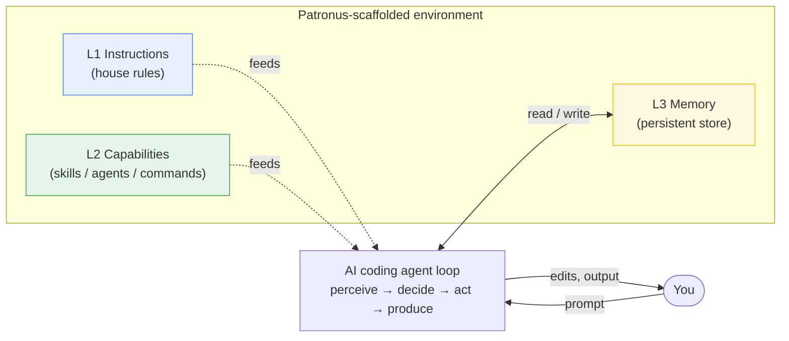
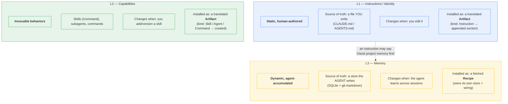
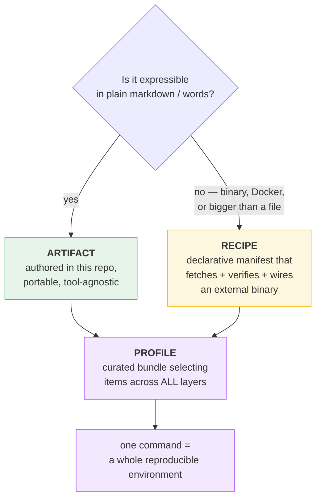
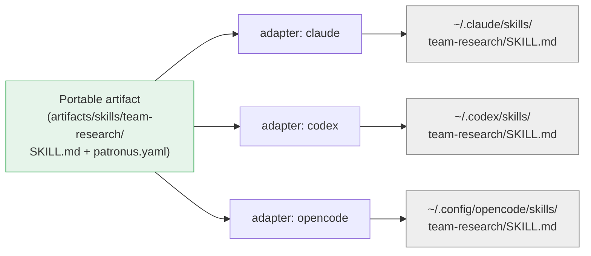
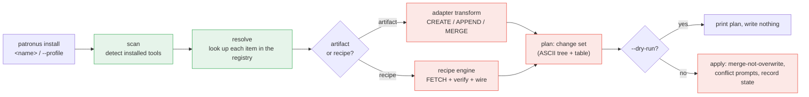

# Patronus

> A **meta-scaffolder** for AI coding environments.

Patronus is not just an installer — it's an **opinionated model of what a complete AI coding
environment is**, plus the machinery to install that environment onto whichever agent tool you use
(**Claude Code**, **OpenAI Codex CLI**, **OpenCode**), at the **global** or **local-repo** scope, on
Linux / macOS / Windows.

You **author or select once**; Patronus **translates per tool** and installs. Add a memory layer, a
set of skills, your house rules, and a curated MCP bundle with a single command — reproducibly.

---

## The core idea

An AI coding agent is a loop: it **perceives** context, **decides**, **acts** on your system, and
**produces** output — with you in the loop. Every part of a good environment either *feeds* that
loop, *constrains* it, *observes* it, or *shares* it. Patronus names those parts as **layers** and
fills each one with an **artifact**, a **recipe**, or a **profile**.



---

## The layers

Patronus models eleven layers. The first three are **Tier 1** — they define the product and are
built first.

| # | Layer | What it solves | Filled by |
|---|-------|----------------|-----------|
| **L1** | **Instructions / Identity** | Who the agent is; house rules & conventions | **Artifact** |
| **L2** | **Capabilities** | What the agent can *do* — skills, subagents, commands | **Artifact** |
| **L3** | **Memory** | Persistence across sessions/repos | **Recipe** |
| L4 | Context / Knowledge | What the agent can *look up* — patterns, docs, code index | Artifact *and* Recipe |
| L5 | Tools / Integrations | The outside world — GitHub, DBs, browser (MCP servers) | Recipe |
| L6 | Sandbox / Execution safety | Constrain FS / network / exec | Recipe |
| L7 | Observability | See what the agent *did* — traces, cost, logs | Recipe + hooks |
| L8 | Evaluation / Harness | Prove output is correct — test/lint/typecheck loops | Artifact + Recipe |
| L9 | Guardrails / Policy | Hard rules — secret-scan, PII, approval hooks | Artifact |
| L10 | Orchestration | Multi-agent coordination, parallel fan-out | Artifact (skills) |
| L11 | Lifecycle / Reproducibility | Pin / lock / share the whole env | Profile + lockfile |

### L1 vs L2 vs L3 — the distinction that matters most

These three are adjacent but **architecturally different**, and conflating them is the most common
mistake. Yes, **there is an L3** — Memory — and it is deliberately separate from L1 Instructions.



In one line each:

- **L1 Instructions** = *what you tell the agent to always do.* You write it; it's static prose;
  Patronus **appends** it into `CLAUDE.md`/`AGENTS.md`. Example in this repo: `agent-principles`.
- **L2 Capabilities** = *what the agent can do on demand.* Invocable skills/agents/commands;
  Patronus **creates** them as files. Examples: `team-research`, `team-implement`, `pattern-cloudflare`.
- **L3 Memory** = *what the agent remembers on its own.* A running store the agent writes to;
  Patronus **fetches and wires** an external engine. Example recipe: `memory-ai-memory`.

They *reference* each other (an L1 rule can say "check memory first") but are installed by entirely
different machinery — that separation is the whole point.

---

## Two kinds of installable thing (+ profiles that bundle them)



- **Artifacts** — skills, subagents, slash commands, instruction snippets. Authored **once** in a
  tool-agnostic form; adapters translate them to each tool's on-disk shape.
- **Recipes** — point at an external binary (a memory engine, a sandbox runner, an MCP server),
  fetch + verify it, and wire it into each tool's config.
- **Profiles** — curated bundles (`golang`, `python`, `cloudflare`) that select items across every
  layer, so one install reproduces a whole opinionated environment.

> **The rule:** plain words → **artifact** (lives here). Binary / Docker / bigger-than-a-file →
> **recipe** (fetched). This resolves every layer's "filled by" column above.

---

## Author once → translate per tool

The same portable artifact installs onto three different tools, each with its own on-disk format.
Adapters (`adapters/*.yaml`) carry the per-tool layout rules — they are **data, not code**.



Each artifact has a **`kind`** (its on-disk shape) and a **`role`** (its job / which layer it fills):

```mermaid
flowchart LR
    subgraph Kinds["kind — on-disk shape (closed set)"]
        K1["Skill → CREATE skills/{name}/"]
        K2["Agent → CREATE agents/{name}"]
        K3["Command → CREATE commands/{name}"]
        K4["Hook → MERGE settings.json"]
        K5["Instruction → APPEND CLAUDE.md"]
    end
    subgraph Roles["role — job / layer (open set)"]
        R1["capability → L2"]
        R2["pattern → L4"]
        R3["instruction → L1"]
        R4["guardrail → L9 (reserved)"]
        R5["harness → L8 (reserved)"]
    end
    Kinds -. "one shape can serve<br/>many jobs" .- Roles
```



---

## The install pipeline

Every install computes a **change set** before touching disk, so `--dry-run` can show exactly what
will happen (and nothing is ever blindly overwritten).



> **Status:** `scan` and `list` work today against a local registry. The transform/recipe/install
> stages are the next phases (see [`DESIGN.md`](DESIGN.md) §8). Stubbed commands print a notice.

---

## Repository layout

```
patronus/
├── artifacts/                  # AUTHOR ONCE — tool-agnostic source of truth
│   ├── instructions/
│   │   └── agent-principles/   # L1 — kind: Instruction (ambient house rules)
│   └── skills/
│       ├── team-research/      # L2 — kind: Skill, role: capability
│       ├── team-implement/     # L2 — kind: Skill, role: capability
│       ├── pattern-cloudflare/ # L4 — kind: Skill, role: pattern
│       └── pattern-mcp/        # L4 — kind: Skill, role: pattern
├── recipes/                    # external binaries to fetch + wire
│   ├── memory-ai-memory.yaml   # L3 — default memory (self-wiring)
│   ├── memory-engram.yaml      # L3 — fallback memory (binary-only)
│   ├── sandbox.yaml            # L6
│   └── github.yaml             # L5 — remote MCP
├── profiles/                   # curated cross-layer bundles
│   ├── golang.yaml  python.yaml  cloudflare.yaml
├── adapters/                   # per-tool layout rules (data, not code)
│   ├── claude.yaml  codex.yaml  opencode.yaml
├── reference/templates/        # author-facing scaffolds — NOT installed onto users
├── cmd/patronus/               # the Go binary entrypoint
├── internal/                   # manifest · registry · scan · render
└── DESIGN.md                   # the full design + phased delivery plan
```

---

## CLI

```bash
patronus list [--artifacts] [--recipes] [--profiles] [--layers] [--json]   # catalog (works today)
patronus scan [--json]                                                      # detect tools (works today)

patronus install <name>... [--tool claude|codex|opencode|all] [--global|--local] [--dry-run]
patronus install --profile <name>                                          # bundle across layers
# install / update / remove / init / lock — in progress (see DESIGN.md §8)
```

Try it from the repo root:

```bash
go run ./cmd/patronus list --profiles --layers
go run ./cmd/patronus scan
```

---

Patronus is under active development. See [`DESIGN.md`](DESIGN.md) for the complete design, manifest
schemas, per-tool on-disk layouts, and phased delivery plan.
