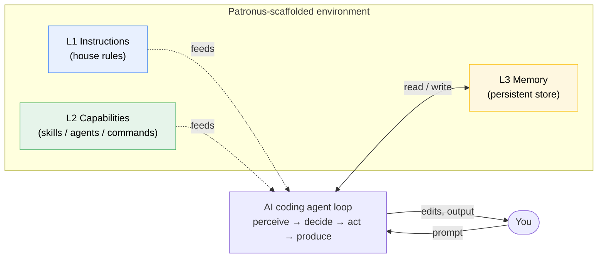
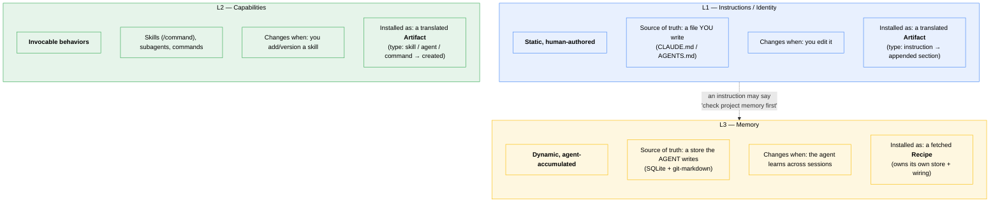
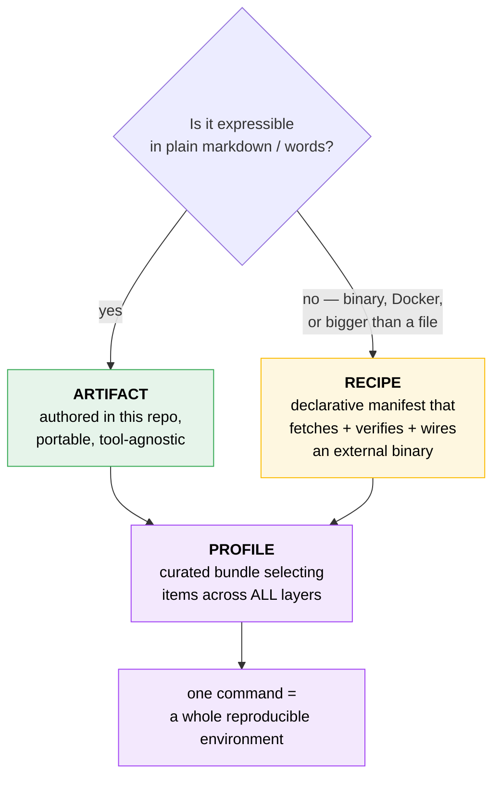
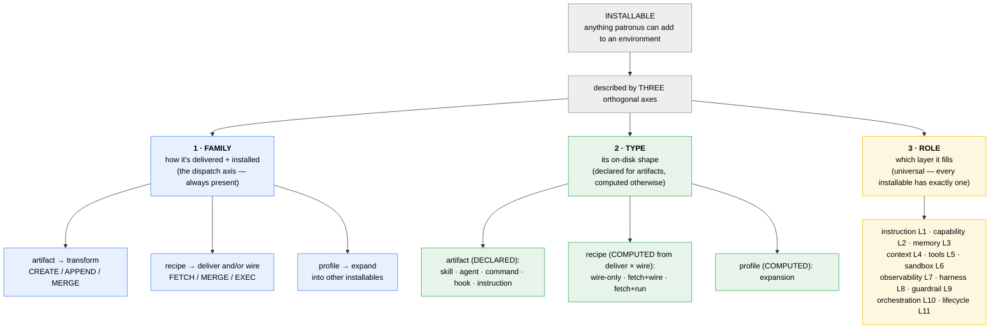
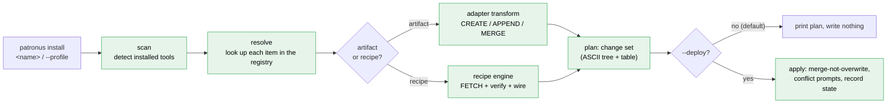

# Patronus

> A **meta-scaffolder** for AI coding environments.

Patronus is not just an installer — it's an **opinionated model of what a complete AI coding
environment is**, plus the machinery to install that environment onto whichever agent tool you use
(**Claude Code**, **OpenAI Codex CLI**, **OpenCode**), at the **global** or **local-repo** scope, on
Linux / macOS / Windows.

You **author or select once**; Patronus **translates per tool** and installs. Add a memory layer, a
set of skills, your house rules, and a curated MCP bundle with a single command — reproducibly.

---

## The core idea

An AI coding agent is a loop: it **perceives** context, **decides**, **acts** on your system, and
**produces** output — with you in the loop. Every part of a good environment either *feeds* that
loop, *constrains* it, *observes* it, or *shares* it. Patronus names those parts as **layers** and
fills each one with an **artifact**, a **recipe**, or a **profile**.



---

## The layers

Patronus models eleven layers. The first three are **Tier 1** — they define the product and are
built first.

| # | Layer | What it solves | Filled by |
|---|-------|----------------|-----------|
| **L1** | **Instructions / Identity** | Who the agent is; house rules & conventions | **Artifact** |
| **L2** | **Capabilities** | What the agent can *do* — skills, subagents, commands | **Artifact** |
| **L3** | **Memory** | Persistence across sessions/repos | **Recipe** |
| L4 | Context / Knowledge | What the agent can *look up* — patterns, docs, code index | Artifact *and* Recipe |
| L5 | Tools / Integrations | The outside world — GitHub, DBs, browser (MCP servers) | Recipe |
| L6 | Sandbox / Execution safety | Constrain FS / network / exec | Recipe |
| L7 | Observability | See what the agent *did* — traces, cost, logs | Recipe + hooks |
| L8 | Evaluation / Harness | Prove output is correct — test/lint/typecheck loops | Artifact + Recipe |
| L9 | Guardrails / Policy | Hard rules — secret-scan, PII, approval hooks | Artifact |
| L10 | Orchestration | Multi-agent coordination, parallel fan-out | Artifact (skills) |
| L11 | Lifecycle / Reproducibility | Pin / lock / share the whole env | Profile + lockfile |

### L1 vs L2 vs L3 — the distinction that matters most

These three are adjacent but **architecturally different**, and conflating them is the most common
mistake. Yes, **there is an L3** — Memory — and it is deliberately separate from L1 Instructions.



In one line each:

- **L1 Instructions** = *what you tell the agent to always do.* You write it; it's static prose;
  Patronus **appends** it into `CLAUDE.md`/`AGENTS.md`. Example in this repo: `agent-principles`.
- **L2 Capabilities** = *what the agent can do on demand.* Invocable skills/agents/commands;
  Patronus **creates** them as files. Examples: `team-research`, `team-implement`, `pattern-cloudflare`.
- **L3 Memory** = *what the agent remembers on its own.* A running store the agent writes to;
  Patronus **fetches and wires** an external engine. Example recipe: `memory-ai-memory`.

They *reference* each other (an L1 rule can say "check memory first") but are installed by entirely
different machinery — that separation is the whole point.

---

## Two kinds of installable thing (+ profiles that bundle them)



- **Artifacts** — skills, subagents, slash commands, instruction snippets. Authored **once** in a
  tool-agnostic form; adapters translate them to each tool's on-disk shape.
- **Recipes** — point at an external binary (a memory engine, a sandbox runner, an MCP server),
  fetch + verify it, and wire it into each tool's config.
- **Profiles** — curated bundles (`golang`, `python`, `cloudflare`) that select items across every
  layer, so one install reproduces a whole opinionated environment.

> **The rule:** plain words → **artifact** (lives here). Binary / Docker / bigger-than-a-file →
> **recipe** (fetched). This resolves every layer's "filled by" column above.

---

## The ontology — family / type / role

Every installable is described by **three orthogonal axes**, each answering one question
with no overlap — so the dry-run summary table shows exactly one axis per column:



| Axis | Question it answers | Present on | Source |
|---|---|---|---|
| **family** | *How does it get installed?* | every installable | declared |
| **type** | *What shape does it take?* | every installable | **declared** for artifacts; **computed** for recipes/profiles |
| **role** | *Which layer / job is it?* | every installable | declared |

`type` is **declared** only where the shape is otherwise ambiguous (an artifact's files
could be a skill or a command — `type` is the only signal). For recipes it is **computed**
from `deliver × wire` (so a recipe has no `type:` field to drift), and for profiles it is
always `expansion`. Role names **are** layer names (L4's role is `context`).

---

## Author once → translate per tool

The same portable artifact installs onto three different tools, each with its own on-disk format.
Adapters (`adapters/*.yaml`) carry the per-tool layout rules — they are **data, not code**.


Each artifact declares a **`type`** (its on-disk shape) and a **`role`** (its job / which layer it fills):

```mermaid
flowchart LR
    subgraph Types["type — on-disk shape (closed set)"]
        K1["skill → CREATE skills/{name}/"]
        K2["agent → CREATE agents/{name}"]
        K3["command → CREATE commands/{name}"]
        K4["hook → MERGE settings.json"]
        K5["instruction → APPEND CLAUDE.md"]
    end
    subgraph Roles["role — job / layer (open set)"]
        R1["capability → L2"]
        R2["context → L4"]
        R3["instruction → L1"]
        R4["guardrail → L9 (reserved)"]
        R5["harness → L8 (reserved)"]
    end
    Types -. "one shape can serve<br/>many jobs" .- Roles
```



---

## The install pipeline

Every install computes a **change set** before touching disk, so `--dry-run` can show exactly what
will happen (and nothing is ever blindly overwritten).



> **Status:** the whole pipeline is live — `scan`, `list`, `install` (artifacts, recipes, and
> `--profile` bundles), `lock`, `build`, `update`, and `remove`/`revert`. Installs are computed against
> a **local** registry (when run inside a checkout) or the **remote** R2 registry (an installed
> binary), and are a **dry run by default** — `--deploy` is what writes. Everything that gets written
> is recorded in `state.json`, which is what makes `remove`/`revert` a clean inverse. See
> [`DESIGN.md`](DESIGN.md) §8 for the phased history.

---

## Repository layout

```
patronus/
├── artifacts/                  # AUTHOR ONCE — tool-agnostic source of truth
│   ├── instructions/
│   │   └── agent-principles/   # L1 — type: instruction (ambient house rules)
│   └── skills/
│       ├── team-research/      # L2 — type: skill, role: capability
│       ├── team-implement/     # L2 — type: skill, role: capability
│       ├── pattern-cloudflare/ # L4 — type: skill, role: context
│       └── pattern-mcp/        # L4 — type: skill, role: context
├── recipes/                    # external binaries to fetch + wire
│   ├── memory-ai-memory.yaml   # L3 — default memory (self-wiring)
│   ├── memory-engram.yaml      # L3 — fallback memory (binary-only)
│   ├── sandbox.yaml            # L6
│   └── github.yaml             # L5 — remote MCP
├── profiles/                   # curated cross-layer bundles
│   ├── golang.yaml  python.yaml  cloudflare.yaml
├── adapters/                   # per-tool layout rules (data, not code)
│   ├── claude.yaml  codex.yaml  opencode.yaml
├── reference/templates/        # author-facing scaffolds — NOT installed onto users
├── cmd/patronus/               # the Go binary entrypoint
├── internal/                   # manifest · registry · scan · plan · adapter · diff · install · state · remove · lock · render
└── DESIGN.md                   # the full design + phased delivery plan
```

---

## CLI

```bash
patronus list [--artifacts] [--recipes] [--profiles] [--layers] [--json]   # browse the catalog
patronus scan [--json]                                                      # detect installed tools

# install — dry run by default; --deploy writes
patronus install <name>... [--tool claude|codex|opencode|all] [--global|--local] [--deploy]
patronus install --profile <name> [--deploy]                               # a cross-layer bundle

# lifecycle
patronus remove <name>...  [--global|--local] [--deploy] [--force]         # uninstall (alias: revert)
patronus update [<name>...] [--all] [--deploy]                             # refresh cache / re-install newer
patronus lock --profile <name>                                            # pin versions to patronus.lock
```

> **Safe by default.** `install`, `remove`, and `update` all *plan* unless you pass `--deploy`. The
> plan is the same artifact-centric table + ASCII change-tree you see below — nothing is written,
> fetched, or executed without `--deploy`.

Try it from the repo root (no install needed):

```bash
go run ./cmd/patronus list --profiles --layers
go run ./cmd/patronus scan
```

---

### Install → what actually changes

`install` never blind-writes. An artifact translates into each tool's on-disk layout as
**CREATE** (new file), **APPEND** (a fenced section in a prose file, leaving your other text alone),
or **MERGE** (a structural config edit that preserves sibling keys). The plan shows it all first:

```console
$ patronus install agent-principles --tool claude --local
┌──────────────────┬──────────────────┬───────────┬─────────────┬─────────────┬────────┬───────┐
│ Artifact         │ Impacted path(s) │ Operation │ Type        │ Role        │ Tool   │ Scope │
├──────────────────┼──────────────────┼───────────┼─────────────┼─────────────┼────────┼───────┤
│ agent-principles │ ./CLAUDE.md      │ APPEND    │ instruction │ instruction │ claude │ local │
└──────────────────┴──────────────────┴───────────┴─────────────┴─────────────┴────────┴───────┘

./
└── CLAUDE.md  (appended)  # APPEND — role: instruction

Plan: 1 APPEND
(dry run — no files were written)
```

Add `--deploy` to apply it. The APPEND wraps the content in markers so it can be removed cleanly later:

```diff
  # My Project                          ← your existing prose, untouched
  some notes of my own
+
+ <!-- patronus:start agent-principles -->
+ # Agent Principles
+ ... house rules ...
+ <!-- patronus:end agent-principles -->
```

---

### Install a profile → a whole environment in one command

A **profile** selects items across several layers, so one `install` lays down an entire opinionated
environment. The plan groups every resulting change by source item, then shows the exact file tree —
so you see precisely what will be created, appended, and run *before* anything happens:

```console
$ patronus install --profile cloudflare --tool claude --local
warning: profile "cloudflare" is a stub: layers marked TODO are not yet populated
┌────────────────────┬───────────────────────────────────────────┬───────────┬─────────────┬─────────────┬────────┬───────┐
│ Artifact           │ Impacted path(s)                          │ Operation │ Type        │ Role        │ Tool   │ Scope │
├────────────────────┼───────────────────────────────────────────┼───────────┼─────────────┼─────────────┼────────┼───────┤
│ pattern-cloudflare │ ./.claude/skills/pattern-cloudflare/ (8…) │ CREATE    │ skill       │ context     │ claude │ local │
│ team-implement     │ ./.claude/skills/team-implement/SKILL.md  │ CREATE    │ skill       │ capability  │ claude │ local │
│ team-research      │ ./.claude/skills/team-research/SKILL.md   │ CREATE    │ skill       │ capability  │ claude │ local │
│ agent-principles   │ ./CLAUDE.md                               │ APPEND    │ instruction │ instruction │ claude │ local │
│ memory-ai-memory   │ ai-memory install-hooks --agent claude    │ EXEC      │ fetch+run   │ memory      │ claude │ local │
│ memory-ai-memory   │ ai-memory install-mcp   --client claude   │ EXEC      │ fetch+run   │ memory      │ claude │ local │
└────────────────────┴───────────────────────────────────────────┴───────────┴─────────────┴─────────────┴────────┴───────┘

./
├── .claude/
│   └── skills/
│       ├── pattern-cloudflare/          # L4 context — a whole pattern set
│       │   ├── SKILL.md  (new)  # CREATE — role: context
│       │   └── patterns/
│       │       ├── pattern-001.md  (new)  # CREATE — role: context
│       │       └── … (006 more)  (new)  # CREATE — role: context
│       ├── team-implement/              # L2 capability
│       │   └── SKILL.md  (new)  # CREATE — role: capability
│       └── team-research/               # L2 capability
│           └── SKILL.md  (new)  # CREATE — role: capability
└── CLAUDE.md  (appended)  # APPEND — role: instruction   ← your prose preserved

Plan: 10 CREATE, 1 APPEND, 2 EXEC
(dry run — no files were written)
```

One profile touched **four layers at once**: an L4 context pattern set and two L2 capability skills
(**CREATE**d as files), L1 house rules (**APPEND**ed into `CLAUDE.md`), and an L3 memory engine
(**EXEC** — the recipe self-wires its hooks + MCP server). Add `--deploy` to apply it; `patronus lock
--profile cloudflare` then pins every resolved item so a teammate reproduces the same set. Running it
again is idempotent — unchanged files become **SKIP**.

> The `stub` warning above is honest: the `cloudflare` profile's instructions/harness slots aren't
> sourced yet, so they're skipped and only the populated layers install. A fully-sourced profile
> shows no such warning.

---

### Lifecycle: `remove` / `revert` / `update`

Patronus records everything it writes in `state.json` (per file: the action, a checksum of the bytes
*it* wrote, and — for APPEND/MERGE — the pre-install bytes). That record is what makes uninstall a
clean **inverse**, not a guess:

| You installed… | `remove` does… |
|---|---|
| a **CREATE**d file | **DELETE** it |
| an **APPEND**ed section | **UNAPPEND** — strip just that fenced block, leave your other prose |
| a **MERGE**d config | **RESTORE** the file to its exact pre-install bytes |

`remove` is also a dry run by default:

```console
$ patronus remove agent-principles --local
./
└── CLAUDE.md  (un-appended)  # UNAPPEND

Plan: 1 UNAPPEND
(dry run — no files were written)

$ patronus remove agent-principles --local --deploy
Removed: 1 undone, 0 skipped
```

**Restoring a merged config** works the same way — here the GitHub MCP recipe was wired into an
existing `.mcp.json`, then removed:

```jsonc
// before install — your own server
{ "mcpServers": { "my-server": { "command": "node", "args": ["server.js"] } } }

// after install --deploy — patronus added "github" alongside it (MERGE, siblings preserved)
{ "mcpServers": {
    "github":    { "type": "http", "url": "https://api.example/mcp/" },
    "my-server": { "command": "node", "args": ["server.js"] } } }

// after remove --deploy — byte-identical to "before install" again (RESTORE)
{ "mcpServers": { "my-server": { "command": "node", "args": ["server.js"] } } }
```

**If you hand-edited a file after install (drift)**, Patronus detects it via the recorded checksum and
**warns + skips** rather than destroying your edits:

```console
$ patronus remove agent-principles --local --deploy
warning: agent-principles (./CLAUDE.md): modified since install; not removed (use --force)

./
└── CLAUDE.md  (skip)  # SKIP

Removed: 0 undone, 1 skipped
```

`--force` overrides the guard and reverts back to the **pre-install** state — note this discards your
manual edits (Patronus keeps a checksum, not your edited bytes; recover those from your VCS). This is
the same contract as a Debian/RPM config-file (`conffile`) upgrade.

**`update`** has two jobs on one command. With no name it just refreshes the registry cache; with a
name it compares the installed version against the registry's latest and re-installs newer ones —
**manual and explicit, never automatic**:

```console
$ patronus update agent-principles --deploy
agent-principles: 1.0.0 -> 1.1.0
... (re-installs at the recorded tool/scope) ...

$ patronus update agent-principles --deploy
agent-principles: up to date (1.1.0)
```

---

Patronus is under active development. See [`DESIGN.md`](DESIGN.md) for the complete design, manifest
schemas, per-tool on-disk layouts, and phased delivery plan.
